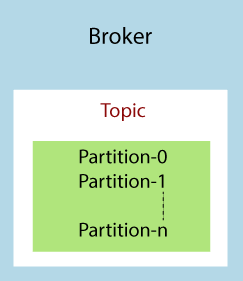
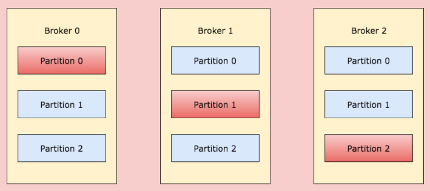
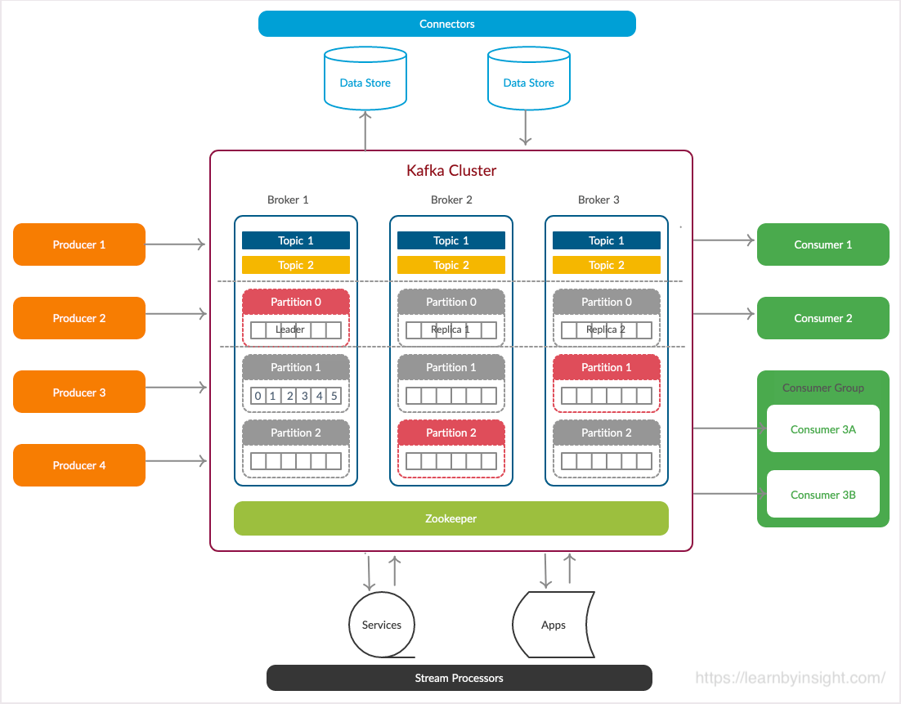

Apache Kafka Fundamentals
--------------
Every company is powered by data. We collect data in, gain insight by analyzing it, manipulate it, and create more as output. It is important to get the data from where it is 
created to where it can be analyzed. For example our clicks on items of interest in websites like Amazon, are turned into recommendations that are shown to us a little later.
The faster we can do this, the more agile and responsive our organizations can be. The less effort we spend on moving data around, the more we can focus on the core business 
at hand.

Before defining apache kafka we are going to define the concept of publish/subscribe messaging and the streaming process. 

The concept of publish/subscribe messaging is a pattern that is characterized by the sender (publisher) of a piece of data (message) not specifically directing it to a receiver. 
Instead, the publisher classifies the message somehow, and that receiver (subscriber) subscribes to receive certain classes of messages. Pub/sub systems often have a broker, a 
central point where messages are published, to facilitate this.

A streaming process is the processing of data in parallelly connected systems. This process allows that one record executes without waiting for the output of the previous record. Therefore, a distributed streaming platform enables the user to simplify the task of the streaming process and parallel execution. Therefore, a streaming platform in Kafka works similar to an enterprise messaging system where it publishes and subscribes streams of records and as soon as the streams of records occur, it processes it.

Apache Kafka is a framework implementation of a software bus using stream-processing. It is a publish-subscribe messaging system which let exchanging of data between applications, servers, and processors as well. It was originally developed by LinkedIn, and later it was donated to the Apache Software Foundation and written in Scala and Java.
Kafka can connect to external systems (for data import/export) via Kafka Connect and provides Kafka Streams, a Java stream processing library.

Kafka is generally used for two broad classes of applications:
- Building real-time streaming data pipelines that reliably get data between systems or applications
- Building real-time streaming applications that transform or react to the streams of data

### Apache Kafka Terminologies :
In this section we will discuss the basic concepts of Kafka. 

Kafka is run as a cluster on one or more servers that can span multiple datacenters. The cluster stores streams of records in categories called topics and each record consists
of a key, a value, and a timestamp. In Kafka the communication between the clients and the servers is done with a simple, high-performance, language agnostic TCP protocol. This protocol is versioned and maintains backwards compatibility with older version. A Java client is provided for Kafka, but clients are available in many languages.

#### 1 - Topics and logs : 
- A topic is a category or feed name to which records are published and used to organize messages. 
- Each topic has a name that is unique across the entire Kafka cluster. 
- Topics in Kafka are similar to tables in the database, but not containing all constraints. 
- Topics in Kafka are always multi-subscriber; that is, a topic can have zero, one, or many consumers that subscribe to the data written to it.
- The Kafka cluster maintains a partitioned log for each topic
<p align="center">
  
</p>

#### 2 - Partitions : 
- A topic is split into several parts which are known as the partitions of the topic.
- When we create a topic we need to specify the number of partitions (the number is arbitrary and can be changed later).
- Each partition is an ordered, immutable sequence of records that is continually appended to—a structured commit log.
- Each message gets stored into partitions with an incremental id known as its Offset value.
- The order of the offset value is guaranteed within the partition only and not across the partition.
- A partition has an infinite number of offsets. 
- The offset value always remains in an incremental state, it never goes back to an empty space. Also, the data is kept in a partition for a limited time only. This limited time
is a called a **configurable retention period**. For example, if the retention policy is set to two days, then for the two days after a record is published, it is available for consumption, after which it will be discarded to free up space. Kafka's performance is effectively constant with respect to data size so storing data for a long time is not a problem. In fact, the only metadata retained on a per-consumer basis is the offset or position of that consumer in the log. 

#### 3 - Brockers : 
- A Broker is a Kafka server that runs in a Kafka Cluster.
- A broker is a container that holds several topics with their multiple partitions. 
- The brokers in the cluster are identified by an integer id only. 
- Kafka brokers are also known as Bootstrap brokers because connection with any one broker means connection with the entire cluster. 
- A broker does not contain whole data, but each broker in the cluster knows about all other brokers, partitions as well as topics.
<p align="center">
  
</p>

#### 4 - Replication across partitions : 
- Kafka enablesa feature of replication to secure data loss even when a broker fails down. 
- The replication factor is always greater than 1. 
- Each partition has one server which acts as the "leader" and zero or more servers which act as "followers". 
- The leader handles all read and write requests for the partition while the followers passively replicate the leader. 
- If the leader fails, one of the followers will automatically become the new leader. 
- Each server acts as a leader for some of its partitions and a follower for others so load is well balanced within the cluster.
- Let take the example below : 
<p align="center">
  
</p>
There are 3 brokers in the kafka cluster and only one topic, each brocker contains a number of partitions of the same topic. the red partitions are leaders and the blue one are
followers. When a client writes something to a topic at a position for which Partition in Broker 0 is the leader, this data is then replicated across the brokers/nodes so that message remains safe. Find [here](https://bravenewgeek.com/tag/leader-election/) more details about data replication.

#### 5 - Confusion in the presence of replica : 
- Cluster may confuse that which broker should save the client request.
- To remove this confusion, one of the broker's partition should be a leader and the rest of them becomes its followers.
- One broker will have only one leader per topic so one broker can have multiple leaders from different topics.
- Followers are allowed to synchronize the data but none of them is allowed to save the request of the client.

#### 6 - Kafka Producer : 
- The producer is responsible for publishing data within partitions of a given topic. 
- It automatically knows the partition and the brocker where the data should be written. 
- The user does not require to specify the broker and the partition.
- Apache Kafka enables the concept of the key to send the messages in a specific order. The key enables the producer with two choices, i.e., either to send data to each partition (automatically) or send data to a specific partition only.
- If the producers apply key over the data, that data will always be sent to the same partition always ( value of the key!=NULL). 
- In Kafka, load balancing is done when the producer writes data to the Kafka topic without specifying any key, Kafka distributes little-little bit data to each partition (value of key=NULL).
- Producers have number of properties like Bootstrap servers, serialization, acks, compression types, etc.
- Bootstrap servers—bootstrap.servers is a comma-separated list of host:port values. Eventually the producer will use all the brokers in the cluster; this list is
used for initially connecting to the cluster.
- Serialization—key.serializer and value.serializer instruct Kafka how to convert the keys and values into byte arrays. Internally, Kafka uses byte arrays
for keys and values, so you need to provide Kafka with the correct serializers to convert objects to byte arrays before them sending across the wire.
- acks—acks specifies the minimum number of acknowledgments from a broker that the producer will wait for before considering a record send completed.
Valid values for acks are all, 0, and 1. With a value of all, the producer will wait for a broker to receive confirmation that all followers have committed the record. When set to 1, the broker writes the record to its log but doesn’t wait for any followers to acknowledge committing the record. A value of 0 means the producer won’t wait for any acknowledgments—this is mostly fire-and-forget.
- Retries—If sending a batch results in a failure, retries specifies the number of times to attempt to resend. If record order is important, you should consider
setting max.in.flight.requests.per.connection to 1 to prevent the scenario of a second batch being sent successfully before a failed record being sent as the result a retry.
- Compression type—compression.type specifies what compression algorithm to apply, if any. If set, compression.type instructs the producer to compress a
batch before sending. Note that it’s the entire batch that’s compressed, not individual records.
- Partitioner class—partitioner.class specifies the name of the class implementing the Partitioner interface.

#### 7 - Kafka Consumer : 
- A consumer is the one that consumes or reads data from the Kafka cluster via a topic. 
- A consumer also knows that from which broker, it should read the data. 
- The consumer reads the data within each partition in an orderly manner. It means that the consumer is not supposed to read data from offset 1 before reading from offset 0. 
- A consumer can easily read data from multiple brokers at the same time

#### 8 - Kafka Consumer Groups : 
- A consumer group is a group of multiple consumers which visions to an application basically. 
- Each consumer present in a group reads data directly from the exclusive partitions. 
- In case, the number of consumers are more than the number of partitions, some of the consumers will be in an inactive state. Somehow, if we lose any active consumer within the group then the inactive one can takeover and will come in an active state to read the data.
- To which consumer should read data first and from which partition, consumers within a group automatically use a 'GroupCoordinator' and one 'ConsumerCoordinator', which assigns a consumer to a partition. This feature is already implemented in the Kafka. Therefore, the user does not need to worry about it.
- Apache Kafka stores an offset value to know at which partition, the consumer group is reading the data.  These offsets are committed live in a topic known as **__consumer_offsets**. This feature was implemented in the case of a machine failure where a consumer fails to read the data. So, the consumer will be able to continue reading from where it left off due to the commitment of the offset.
- Committing an offset is like a bookmark which a reader uses while reading a book or a novel and there are three delivery semantics : at most once, at least once, exactly once.
- At most once: Here, the offsets are committed as soon as the consumer receives the message.. But in case of incorrect processing, the message will be lost, and the consumer will not be able to read further. Therefore, this semantic is the least preferred one.
- At least once: Here, the offsets are committed after the message has been processed. If the processing goes wrong, then the message will be read again by the consumer. Therefore, this is usually preferred to use. Because a consumer can read the message twice, it results in duplicate processing of the messages. Thus, it needs a system to be an idempotent system.
- Exactly once: Here, the offsets can be achieved for Kafka to Kafka workflow only using the Kafka Streams API. For achieving offset for Kafka to the external system, we need to use an idempotent consumer.

### Apache Kafka Architecture : 
<p align="center">
  
</p>
Apache ZooKeeper is an open source that helps build distributed applications. It’s a centralized service for maintaining configuration information. It holds responsibilities like:
- Broker state : maintains list of active brokers and which cluster they are part of.
- Topics configured : maintains list of all topics, number of partitions for each topic, location of all replicas, who is the preferred leader, list of ISR for partitions.
- Controller election : selects a new controller whenever a node shuts down. Also, makes sure that there is only one controller at any given time.
- ACL info : maintains Access control lists (ACLs) for all the topics.
- Cluster membership : Joining a cluster and maintaining membership in a cluster. If a broker becomes unavailable, ZooKeeper removes the broker from cluster membership.


### Apache Kafka APIs
Kafka have 5 majors APIs:
- **Producer API**: Permits an application to publish streams of records to one or more topics in the kafka cluster. Below the maven demendency to use the producer. 
```xml
<dependency>
	<groupId>org.apache.kafka</groupId>
	<artifactId>kafka-clients</artifactId>
	<version>2.0.0</version>
</dependency>
```
- **Consumer API**: Allows an application to subscribe one or more topics and process the stream of records produced to them. Below the maven demendency to use the consumer. 
```xml
<dependency>
	<groupId>org.apache.kafka</groupId>
	<artifactId>kafka-clients</artifactId>
	<version>2.0.0</version>
</dependency>
```
- **Streams API**: Allows an application to effectively transform the input streams to the output streams. It permits an application to act as a stream processor which consumes an input stream from one or more topics, and produce an output stream to one or more output topics.
```xml
<dependency>
	<groupId>org.apache.kafka</groupId>
	<artifactId>kafka-streams</artifactId>
	<version>2.0.0</version>
</dependency>
```
- **Connector API**: The Connect API allows implementing connectors that continually pull from some source data system into Kafka or push from Kafka into some sink data system.
Many users of Connect won't need to use this API directly, though, they can use pre-built connectors without needing to write any code.
- **Admin API**: Used to manage Kafka topics, brokers and other Kafka objects.
```xml
<dependency>
	<groupId>org.apache.kafka</groupId>
	<artifactId>kafka-clients</artifactId>
	<version>2.0.0</version>
</dependency>
```


