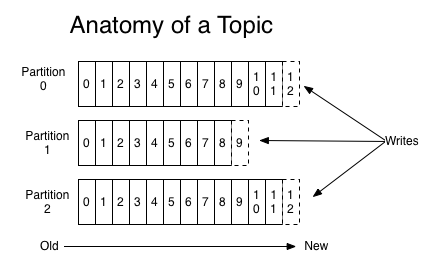

Apache Kafka Fundamentals
--------------
Every company is powered by data. We collect data in, gain insight by analyzing it, manipulate it, and create more as output. It is important to get the data from where it is 
created to where it can be analyzed. For example our clicks on items of interest in websites like Amazon, are turned into recommendations that are shown to us a little later.
The faster we can do this, the more agile and responsive our organizations can be. The less effort we spend on moving data around, the more we can focus on the core business 
at hand.

Before defining apache kafka we are going to define the concept of publish/subscribe messaging and the streaming process. 

The concept of publish/subscribe messaging is a pattern that is characterized by the sender (publisher) of a piece of data (message) not specifically directing it to a receiver. 
Instead, the publisher classifies the message somehow, and that receiver (subscriber) subscribes to receive certain classes of messages. Pub/sub systems often have a broker, a 
central point where messages are published, to facilitate this.

A streaming process is the processing of data in parallelly connected systems. This process allows that one record executes without waiting for the output of the previous record. Therefore, a distributed streaming platform enables the user to simplify the task of the streaming process and parallel execution. Therefore, a streaming platform in Kafka works similar to an enterprise messaging system where it publishes and subscribes streams of records and as soon as the streams of records occur, it processes it.

Apache Kafka is a framework implementation of a software bus using stream-processing. It is a publish-subscribe messaging system which let exchanging of data between applications, servers, and processors as well. It was originally developed by LinkedIn, and later it was donated to the Apache Software Foundation and written in Scala and Java.
Kafka can connect to external systems (for data import/export) via Kafka Connect and provides Kafka Streams, a Java stream processing library.

Kafka is generally used for two broad classes of applications:
- Building real-time streaming data pipelines that reliably get data between systems or applications
- Building real-time streaming applications that transform or react to the streams of data

### Apache Kafka Terminologies :
In this section we will discuss the basic concepts of Kafka. 

Kafka is run as a cluster on one or more servers that can span multiple datacenters. The cluster stores streams of records in categories called topics and each record consists
of a key, a value, and a timestamp. In Kafka the communication between the clients and the servers is done with a simple, high-performance, language agnostic TCP protocol. This protocol is versioned and maintains backwards compatibility with older version. A Java client is provided for Kafka, but clients are available in many languages.

#### 1 - Topics and logs : 
- A topic is a category or feed name to which records are published and used to organize messages. 
- Each topic has a name that is unique across the entire Kafka cluster. 
- Topics in Kafka are similar to tables in the database, but not containing all constraints. 
- Topics in Kafka are always multi-subscriber; that is, a topic can have zero, one, or many consumers that subscribe to the data written to it.
- The Kafka cluster maintains a partitioned log for each topic
<p align="center">
  
</p>

#### 2 - Partitions : 
- A topic is split into several parts which are known as the partitions of the topic.
- When we create a topic we need to specify the number of partitions (the number is arbitrary and can be changed later).
- Each partition is an ordered, immutable sequence of records that is continually appended to—a structured commit log.
- Each message gets stored into partitions with an incremental id known as its Offset value.
- The order of the offset value is guaranteed within the partition only and not across the partition.
- A partition has an infinite number of offsets. 
- The offset value always remains in an incremental state, it never goes back to an empty space. Also, the data is kept in a partition for a limited time only.


### Apache Kafka Architecture : 

### Apache Kafka APIs
Kafka have 5 majors APIs:
- **Producer API**: Permits an application to publish streams of records to one or more topics in the kafka cluster. Below the maven demendency to use the producer. 
```xml
<dependency>
	<groupId>org.apache.kafka</groupId>
	<artifactId>kafka-clients</artifactId>
	<version>2.0.0</version>
</dependency>
```
- **Consumer API**: Allows an application to subscribe one or more topics and process the stream of records produced to them. Below the maven demendency to use the consumer. 
```xml
<dependency>
	<groupId>org.apache.kafka</groupId>
	<artifactId>kafka-clients</artifactId>
	<version>2.0.0</version>
</dependency>
```
- **Streams API**: Allows an application to effectively transform the input streams to the output streams. It permits an application to act as a stream processor which consumes an input stream from one or more topics, and produce an output stream to one or more output topics.
```xml
<dependency>
	<groupId>org.apache.kafka</groupId>
	<artifactId>kafka-streams</artifactId>
	<version>2.0.0</version>
</dependency>
```
- **Connector API**: The Connect API allows implementing connectors that continually pull from some source data system into Kafka or push from Kafka into some sink data system.
Many users of Connect won't need to use this API directly, though, they can use pre-built connectors without needing to write any code.
- **Admin API**: Used to manage Kafka topics, brokers and other Kafka objects.
```xml
<dependency>
	<groupId>org.apache.kafka</groupId>
	<artifactId>kafka-clients</artifactId>
	<version>2.0.0</version>
</dependency>
```
