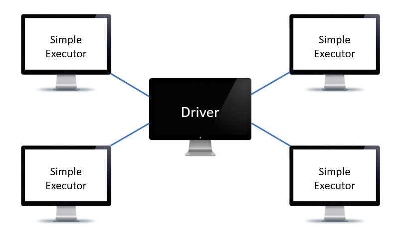

Introduction to Distributed Computing
------------

We already reviewed [a general introduction to Big Data](https://github.com/nouhaaa/Data-Engineer-Science-Notes/tree/main/General%20Introduction%20to%20Big%20Data).
Now we will explain the idea behind Distributed Computing. 

Imagine that you and your colleagues have been asked to guess how many M&Ms are in a big tub and told you whoever finished counting them first wins a prize. 

You might line the M&Ms up and count them one by one to finish get their exact quantity. This method will give you an accurate count but you will spen a very long time to do it.

Another solution is to get the weight of one M&Ms botton and then get the whole weight of the tub and figure out how many pieces there are. This is a quick method but 
you cannot grantee that all the M&Ms have the same weight. So you might not have an accurate count. 

So the first solution is slow but gives an accurate count and the second solution is quick but does not garantee a good accuracy. What if you distribute the 
M&M's among your colleagues? So instead of having to do the whole count on your own you can devide it between yourself and your colleagues so that everyone will count 
a subset of M&M's that exist in the tub. This method will granatee an accurate result in a quicker time than the first method. 

This is exactly the idea behind the distributed computing which divide the data into smaller chunks and distribute it among different computers. So each computer 
will have the count of it own chunk. 

Companies use Apache Spark to process their big data in a distributed way. If we apply apache spark in this example, the person who will distribute the M&Ms among his
colleagues is called **Driver**. The driver is not counting anything but he will have a track of what is going on with the other machines. The entire work of counting is called
a **Spark Job**. The stage one of the job is done when each machine count the number of M&M's of its chunk. The job is done when we aggregate all the individual counts. 
To do it, one of the machine must get all the individual counts and return it to the driver. 

