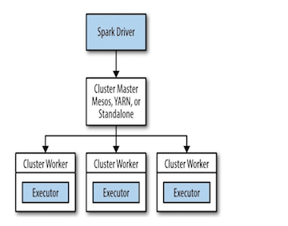

How Apache Spark Runs on a Cluster? 
------

In this document we will see how does apache spark run on a cluster. 

A single computer is a machine which has : 
- Computing Resources : CPU, RAM, GPU, Network interface and hard disks. 
- Operating System 
- Applications

This machine works perfectly well for watching movies or working with spreadsheet software. The operating system of a given machine is responsible for resource managing. 
It schedule and decide how much any application can use RAM or CPU or GPU etc. However, as many users likely experience at some point, there are somethings 
that the computer is not powerful enough to perform. One particularly challenging area is **data processing**. 

In fact, single machines do not have enough power and resources to perform computations on huge amounts of information. A cluster, or group, of computers, pools the 
resources of many machines together, giving us the ability to use all the cumulative resources as if they were a single computer. Now, a group of machines alone is not 
powerful, you need a framework to coordinate work across them. Spark does just that, managing and coordinating the execution of tasks on data across a cluster of 
computers.

In the single computer the operating system is responsible for managing the resources. In the cluster of machines that Spark will use to execute tasks the cluster manager 
will be responsible for managing the resources like Spark’s standalone cluster manager, YARN, or Mesos. We then submit Spark Applications to these cluster managers, 
which will grant resources to our application so that we can complete our work.

### The Architecture of a Spark Application
Spark Applications consist of a **driver process** and a **set of executor processes**.
- Driver process : runs your main() function, sits on a node in the cluster, and is responsible for three things. Maintaining information about the Spark Application; 
responding to a user’s program or input;and analyzing, distributing, and scheduling work across the executors.
- Executors : are responsible for actually carrying out the work that the driver assigns them. This means that each executor is responsible for only two things which are
executing code assigned to itby the driver, and reporting the state of the computation on that executor back to the driver node. Each Spark Application has its ownseparate 
executor processes.

- The cluster manager : The Spark Driver and Executors do not exist in a void, and this is where the cluster manager comes in. The cluster manager is responsible 
for maintaining a cluster of machines that will run your Spark Application(s). Somewhat confusingly, a cluster manager will have its own “driver” (sometimes called 
master) and “worker” abstractions. The core difference is that these are tied to physical machines rather than processes (as they are in Spark).
When it comes time to actually run a Spark Application, we request resources from the clustermanager to run it. Depending on how our application is configured, 
this can include a place torun the Spark driver or might be just resources for the executors for our Spark Application.

### Execution Modes
An execution mode gives the power to determine where the aforementioned resources arephysically located when you go to run your application. 
We have three modes to choose from:
- Cluster Mode : Start the driver on the cluster
- Client Mode : Start the driver on your local machine
- Local Mode : Start everything in a single local JVM 

