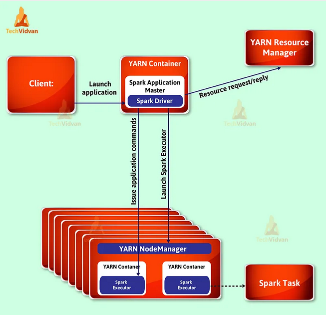
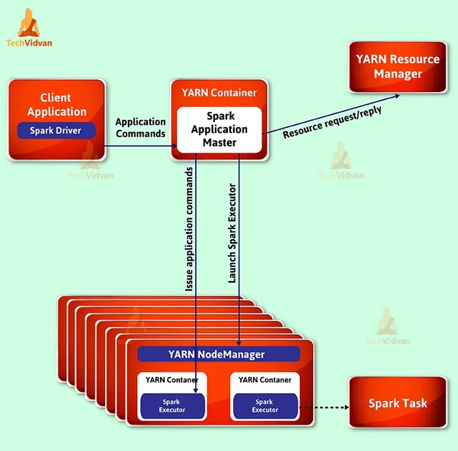

How Apache Spark Runs on a Cluster? 
------

In this document we will see how does apache spark run on a cluster. 

A single computer is a machine which has : 
- Computing Resources : CPU, RAM, GPU, Network interface and hard disks. 
- Operating System 
- Applications

This machine works perfectly well for watching movies or working with spreadsheet software. The operating system of a given machine is responsible for resource managing. 
It schedule and decide how much any application can use RAM or CPU or GPU etc. However, as many users likely experience at some point, there are somethings 
that the computer is not powerful enough to perform. One particularly challenging area is **data processing**. 

In fact, single machines do not have enough power and resources to perform computations on huge amounts of information. A cluster, or group, of computers, pools the 
resources of many machines together, giving us the ability to use all the cumulative resources as if they were a single computer. Now, a group of machines alone is not 
powerful, you need a framework to coordinate work across them. Spark does just that, managing and coordinating the execution of tasks on data across a cluster of 
computers.

In the single computer the operating system is responsible for managing the resources. In the cluster of machines that Spark will use to execute tasks the cluster manager 
will be responsible for managing the resources like Spark’s standalone cluster manager, YARN, or Mesos. We then submit Spark Applications to these cluster managers, 
which will grant resources to our application so that we can complete our work.


### The Architecture of a Spark Application
Spark Applications consist of a **driver process** and a **set of executor processes**.
- Driver process : runs your main() function, sits on a node in the cluster, and is responsible for three things. Maintaining information about the Spark Application; 
responding to a user’s program or input;and analyzing, distributing, and scheduling work across the executors.
- Executors : are responsible for actually carrying out the work that the driver assigns them. This means that each executor is responsible for only two things which are
executing code assigned to itby the driver, and reporting the state of the computation on that executor back to the driver node. Each Spark Application has its ownseparate 
executor processes.

<p align="center">
  
</p>


- The cluster manager : The Spark Driver and Executors do not exist in a void, and this is where the cluster manager comes in. The cluster manager is responsible 
for maintaining a cluster of machines that will run your Spark Application(s). Somewhat confusingly, a cluster manager will have its own “driver” (sometimes called 
master) and “worker” abstractions. The core difference is that these are tied to physical machines rather than processes (as they are in Spark).
When it comes time to actually run a Spark Application, we request resources from the clustermanager to run it. Depending on how our application is configured, 
this can include a place torun the Spark driver or might be just resources for the executors for our Spark Application.


### Spark Execution Model
Spark is a distributed processing engine, and it follows the master-slave architecture. So, for every application, Spark will create one master process and multiple slave processes. In Spark terminology, the master is the driver, and the slaves are the executors. Let's try to understand it with a simple example. 

<p align="center">
  
</p>

Suppose you are using the spark-submit utility. You execute an application A1 using spark-submit, and Spark will create one driver process and some executor processes for A1. This entire set is exclusive for the application A1.
Now, you submit another application A2, and Spark will create one more driver process and some executor process for A2. So, for every application, Spark creates one driver and a bunch of executors. 

### Execution Modes
An execution mode gives the power to determine where the aforementioned resources arephysically located when you go to run your application. 
We have three modes to choose from:
- Cluster Mode : Start the driver on the cluster
- Client Mode : Start the driver on your local machine
- Local Mode : Start everything in a single local JVM 


#### 1 - Cluster Mode
Cluster mode is probably the most common way of running Spark Applications. The driver program won't run on the machine from the job submitted but it runs on the 
cluster as a sub-process of ApplicationMaster. In cluster mode, a user submits a pre-compiled JAR, Python script, or R script to a cluster manager. The cluster manager then launches the driver process on a worker node (this node shows as a driver on the Spark Web UI of the application) inside the cluster, in addition to the executor processes. This means that the cluster manager is responsible for maintaining all Spark Application–related processes. 

<p align="center">
  
</p>

The advantage of this mode is running driver program in ApplicationMaster, which re-instantiate the driver program in case of driver program failure. Cluster mode is not supported in interactive shell mode i.e., saprk-shell mode. Cluster mode is used in real time production environment and also mostly used for large data sets where the job takes few mins/hrs to complete. To use this mode we have submit the Spark job using spark-submit command.

In this mode we must need a cluster manager to allocate resources for the job to run. Below the cluster managers available for allocating resources:

- Standalone: simple cluster manager that is embedded within Spark, that makes it easy to set up a cluster
- Apache Mesos: a cluster manager that can be used with Spark and Hadoop MapReduce.
- YARN: resource manager in Hadoop 2
- Kubernetes: an open source cluster manager that is used to automating the deployment, scaling and managing of containerized applications.

 
<p align="center">
  
</p>

 Applications can be submitted to a cluster of any type using the spark-submit script :
  ```
  spark-submit --deploy-mode cluster --driver-memory xxxx  ........
  ```
This script takes care of setting up the classpath with Spark and its dependencies, and can support different cluster managers and deploy modes that Spark supports:
 ```
  ./bin/spark-submit \
  --class <main-class> \
  --master <master-url> \
  --deploy-mode <deploy-mode> \
  --conf <key>=<value> \
  ... # other options
  <application-jar> \
  [application-arguments]
  ```
  
 Some of the commonly used options are:
 
    --class: The entry point for your application (e.g. org.apache.spark.examples.SparkPi)
    --master: The master URL for the cluster (e.g. spark://23.195.26.187:7077)
    --deploy-mode: Whether to deploy your driver on the worker nodes (cluster) or locally as an external client (client) (default: client) †
    --conf: Arbitrary Spark configuration property in key=value format. For values that contain spaces wrap “key=value” in quotes (as shown). Multiple configurations should be passed as separate arguments. (e.g. --conf <key>=<value> --conf <key2>=<value2>)
    application-jar: Path to a bundled jar including your application and all dependencies. The URL must be globally visible inside of your cluster, for instance, an hdfs:// path or a file:// path that is present on all nodes.
    application-arguments: Arguments passed to the main method of your main class, if any

- Terminating the current session doesn’t terminate the application. The application would be running on the cluster. You can get the status of the spark application by running ```spark-submit --status [submission ID] ```
- Since Spark driver runs on one of the worker node within the cluster, which reduces the data movement overhead between submitting machine and the cluster.
- For the Cloudera cluster, you should use yarn commands to access driver logs.
- In this spark mode, the change of network disconnection between driver and spark infrastructure reduces. As they reside in the same infrastructure(cluster), It highly reduces the chance of job failure.
- We use this mode when the client machine is far from our actual cluster then we should go for cluster mode. Because if we launch it in client mode then for executors to communicate with driver causes network latency and also if the client machine goes offline then we lose entire application.  


#### 2 - Client Mode
Client mode is nearly the same as cluster mode except that the Spark driver remains on the clientmachine that submitted the application. This means that the client machine is responsible formaintaining the Spark driver process, and the cluster manager maintains the executor processses.
The main drawback of this mode is if the driver program fails entire job will fail. Client mode can also use YARN to allocate the resources. Client mode can support both interactive shell mode and normal job submission modes. But this mode gives us worst performance. In production environment this mode will never be used.

- Client mode can be used when the client machine is located within the cluster. In this case we don't need to worry about any network latency and maintenance of cluster will taken with utmost important so no need to worry about failures as well.

<p align="center">
  
</p>

```
spark-submit --deploy-mode client --driver-memory xxxx  ......
```
    
- The default deployment mode is client mode.
- In client mode, if a machine or a user session running spark-submit terminates, your application also terminates with status fail.
- Using Ctrl-c after submitting the spark-submit command also terminates your application.
- Client mode is not used for Production jobs. This is used for testing purposes.
- Driver logs are accessible from the local machine itself.


#### 3 - Local Mode
Local mode is a significant departure from the previous two modes: it runs the entire SparkApplication on a single machine. It achieves parallelism through threads on that single machine.This is a common way to learn Spark, to test your applications, or experiment iteratively withlocal development. However, we do not recommend using local mode for running productionapplications.
In this mode the driver program and executor will run on single JVM in single machine. This mode is useful for development, unit testing and debugging the Spark Jobs. But this mode has lot of limitations like limited resources, has chances to run into out memory is high and cannot be scaled up. In addition, in this mode Spark will not re-run the  failed tasks, however we can overwrite this behavior. Spark UI will be available on localhost:4040 in this mode.


#### References : 
http://www.bigdatainterview.com/what-are-deployment-modes-in-spark-client-vs-cluster-modes/
https://spark.apache.org/docs/latest/submitting-applications.html
https://spark.apache.org/docs/latest/cluster-overview.html
https://sparkbyexamples.com/spark/spark-web-ui-understanding/
https://techvidvan.com/tutorials/spark-modes-of-deployment/
