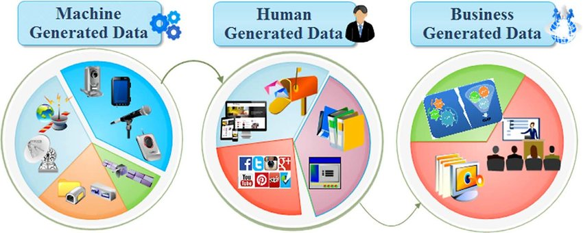

Where Data come from ?
------------

In the last two decades, the volume and speed with which data is generated has changed beyond measures of human comprehension. The total amount of data in the world was **4.4 zettabytes in 2013**. That is set to rise steeply to **44 zettabytes by 2020**.
To put that in perspective, 44 zettabytes is equivalent to 44 trillion gigabytes. Even with the most advanced technologies today, it is impossible to analyze all this data. The need to process these increasingly larger (and unstructured) data sets is how traditional data analysis transformed into ‘Big Data’ in the last decade.

The three main sources of data are : 
- Human-generated

- Machine-generated

- Organization-generated

Now I will explain how data comes from each source above. 

### Human generated data : 

Humans create and share data using social media posts, emails, spreadsheets, presentations, audio files and video files. 

Social media is a leading force in the propagation of human-generated data. At Facebook and According to Forbes, 1.5 billion people are active on Facebook every day, 510,000 comments are posted every minute, and five new profiles are created every second. 

### Machine generated data : 

Data generated from machines that doesn’t rely on active human intervention like sensors on vehicles, industrial machine, security cameras, satellites, medical devices and personal tools such as smartphone apps or fitness trackers. These sensors Depend on the model that they have, they might generate records for your heart rate, your geographic location, the calories you burn, and more. 

### Organization generated data : 

Records generated every time you make a purchase at an online or physical store - things like unique customer numbers, the items you purchased, the date and time you purchased items and how many of each item you purchased.

 
