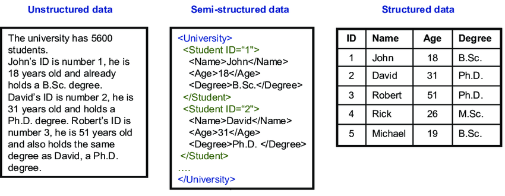
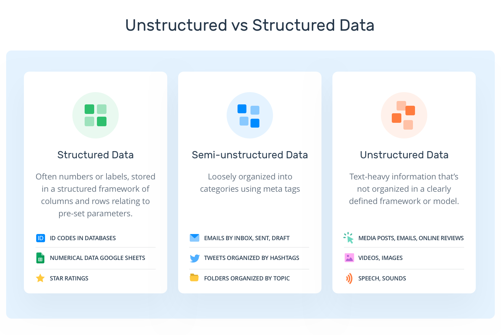

In [Characteristics_of_Big_Data.md](https://github.com/nouhaaa/Data-Engineer-Notes/blob/main/General%20Introduction%20to%20Big%20Data/Characteristics_of_Big_Data.md), 
we reviewed the characteristics of big data. One of those characteristics was data variety. Now, we’ll explore data variety at a deeper level, and look at how different 
types of data are structured. We will discuss above the different types of data: 

### 1 - Strunctured Data : 

The term structured data refers to any data that conforms to a certain format or schema. 

A popular example of structured data is a spreadsheet. In a spreadsheet, there are usually clearly labeled rows and columns, and the information within those rows and columns follows a certain format. In the spreadsheet below for example, we see that months are written as three-letter words, customer IDs are five-digit long numerical values and colors are formatted as "Name|Name". 

Because structured data is clearly organized, it’s generally easier to analyze. For example, if I asked you to look at the spreadsheet below and tell me how much money we made for all of these orders, you could easily tell me because the prices listed here are numeric and can be summed up.

A lot of the data that organizations work with every day can be categorized as structured data.

### 2 - Unstructured Data : 

By contrast, unstructured data is often referred to as "messy" data, because it isn’t easily searched compared to structured data. For example, imagine that you're asked to determine how much money a retail store generates in one day. If you are given structured data, like a spreadsheet of daily sales, this is a relatively simply task. However, if instead of a spreadsheet you are given camera footage of each transaction and asked to determine the sales revenue from that, it will be a much harder task! 

Unstructured data is the most widespread type of data. The IDC reports that almost 90% of data today is unstructured. Today, many organizations struggle with trying to make sense of unstructured data, especially when trying to use it for business insights. That's where different fields of artificial intelligence become an important part of the data analysis process.

### 3 - Semi-Structured Data : 

Semi-structured data fits somewhere in-between structured and unstructured data. Semi-structured data does not reside in a formatted table, but it does have some level of organization. 

A good example of semi-structured data is HTML code. If you’ve ever right-clicked in your browser and selected “inspect” or “inspect element” you’ve seen an example of this. Although you are not restricted to how much information you want to collect or what kind of information you want to collect, there is still a defined way to express data.

